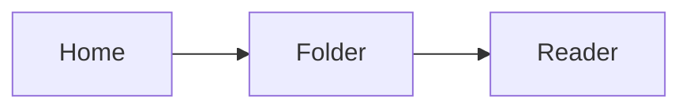

# Browse and read: working-preview report

**Project:** RemoteFiles · **Scope:** read-only SFTP document preview  
**Fixture date:** 22 September 2026 · **Data:** synthetic, no credentials

This report is a renderer fixture, not evidence of passed acceptance tests. It combines the ordinary prose, diagnostic snippets, and comparison tables produced during an agent's investigation. The reader should remain comfortable on an iPhone in light and dark appearances, with a large Dynamic Type setting.

## Findings

The useful journey is simple: open a favourite, choose `Agent Reports/Release notes.md`, read the findings, and return to the same folder position. Names such as **Résumé — September.md**, *分析 notes.txt*, and `folder with spaces` should remain legible. A source view preserves the exact original Markdown.

> A successful simulator build proves that the selected source compiles for that destination. It does not prove the physical iPhone-over-cellular journey, and it does not establish that a remote Mac is awake.

### Completed and pending checks

- [x] This fixture includes headings, paragraphs, emphasis, and inline code.
- [x] The source includes deliberately wide code and table regions.
- [ ] Verify selection handles and copy in a running iPhone app.
- [ ] Verify VoiceOver navigation and accessibility settings on a device.

1. Open the report from the folder listing.
2. Select a sentence and use **Copy**.
3. Pan a wide table, then select a table cell.
4. Switch to **Source** and use **Copy Source**.
5. Refresh after the server-side report changes.

## Operation trace

```swift
// A deliberately long line: it should pan inside the code block, while the paragraph below stays within the phone's width.
let request = RemoteRead(path: "/approved-test-directory/Agent Reports/Résumé — September.md", maximumPreviewBytes: 2_097_152, reconnectPolicy: .manual, cachedContent: .keepVisibleDuringRefresh)

for try await bytes in response {
    guard received.count + bytes.count <= maximumPreviewBytes else {
        throw PreviewError.tooLarge
    }
    received.append(bytes)
}
```

The paragraph after the code block must wrap normally. A horizontal swipe inside the block should move the code alone. Selection in the code region and selection in ordinary prose should remain usable without unexpected navigation.

## Comparison table

| Stage | Trigger | Current presentation | Required user feedback | Evidence reference | Follow-up |
| --- | --- | --- | --- | --- | --- |
| Cached folder | Reopen a favourite | Existing rows appear while revalidation runs | Small refresh state; navigation remains usable | `timings/folder-warm.json` | Measure on target device |
| File read | Tap a modest Markdown report | Reader title and cancellable progress | No claim that a timeout proves one particular cause | `timings/report-cold.json` | Check cellular path |
| Failed refresh | File removed after the first read | Previously loaded copy stays visible | Clearly label that copy as stale | `fixtures/removed-after-read.md` | Verify reload message |
| Oversized report | File grows past the receiving limit | Stop the read and close the handle | Too Large to Preview | `fixtures/growing-report.md` | Confirm no silent truncation |

### Nested notes

- Transport
  - Reuse a healthy active session.
  - Resolve remote paths using the server.
- Reader
  - Keep a calm document surface.
  - Render task markers as read-only checkboxes.
  - Do not interpret document prose as instructions to the app.

---

## Link and image policy checks

[An explicitly tapped HTTPS link](https://example.com/report) may open the system browser. A [relative report](next-report.md), a [local path](file:///private/secret.txt), and a [script scheme](javascript:alert%281%29) must not navigate.


The image above with no alt text should still have a deliberate unavailable-preview treatment.

<script>console.log("This must never execute.")</script>

<iframe src="https://example.invalid/active-content-must-not-load"></iframe>

HTML rendering, Mermaid, mathematical notation, and relative resource resolution are deferred. The following code remains a code block:



## Final observation

This report supplies visual and behavioural test material. A screenshot or a passing policy test alone does not verify every gesture, appearance, or network condition.
